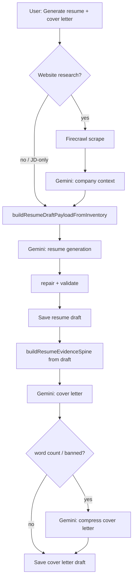

# AI Call & Prompt Study

**Milestone:** Matching/Tailoring Engine Upgrade (planning)  
**Version at study:** v0.9.16E  
**Purpose:** Inventory every Gemini touchpoint before adding evidence-spine work. **No new AI calls** unless this study justifies them.

---

## Summary

| Call | Trigger | LLM vs deterministic | Change for upgrade |
|------|---------|----------------------|-------------------|
| Enrichment | User on Inventory | LLM | Keep LLM; out of tailoring spine scope |
| Inventory text extraction | User paste → Extract | LLM | Keep LLM; feeds inventory, not per-job ranking |
| Company context | Generate (optional) / manual | LLM (+ Firecrawl scrape, not Gemini) | Keep LLM; inputs to story spine, not ranking |
| **Resume generation** | Generate / full regenerate | LLM | **Deterministic evidence spine before Gemini**; pass ranked shortlist |
| **Cover letter generation** | Generate combined / package | LLM | **Deterministic story spine from full inventory**; resume draft = consistency only |
| Cover letter compression | Auto retry on word count / banned phrase | LLM | Keep; same prompt family |
| Targeted role rewrite | Add Evidence apply | LLM | Keep; pass spine-ranked forced bullets |
| Resume scoped revision | Package edit queue | LLM | Keep; optional spine context later |
| Cover letter revision | Package / editor quick actions | LLM | Keep; widen evidence spine input |

**Not justified:** separate critique AI call, embeddings/ML ranking, JD extraction Gemini pass (heuristic JD terms already exist in `extractJdMatchTerms`).

---

## Shared infrastructure

| Piece | Location | Notes |
|-------|----------|-------|
| HTTP + retry | `src/lib/ai/call-gemini.ts` | Up to 3 attempts; transient 429/503/5xx; model fallback on 404 |
| Model tiers | `src/lib/ai/model-tiers.ts` | `standard` / `premium`; primary + fallback model IDs |
| Logging | `logGeminiCallMetadata` | `[gemini-call]` JSON: logical step, tier, model, attempts — **no prompts** |
| Provider switch | `AI_PROVIDER=gemini\|mock` | Mock paths mirror contracts for tests |

**Retry can duplicate work:** each retry is a full `generateContent` call. Cover letter compression is an **additional** logical step (not counted in Generate pre-estimate).

---

## 1. Inventory enrichment

| Field | Value |
|-------|-------|
| **Route** | `POST /api/ai/enrich` |
| **Provider** | `src/lib/ai/gemini.ts` → `buildEnrichmentPrompt` |
| **User action** | Inventory → Enrichment review → run enrichment (batch or test batch) |
| **Temperature** | 0.2 |
| **Output** | Strict JSON: bullet suggestions, duplicate groups, keyword/capability hints |

### Prompt inputs

- `EnrichmentInventoryInput.bullets[]`: `bulletKey`, company, role, description, citations (collated work experience only via `buildEnrichmentInput`)

### Structured inputs

- None beyond bullet list JSON in prompt.

### Expected output

- Parsed → `mapEnrichmentPayload` → `EnrichmentResult` (suggestions, duplicate groups).

### Persisted / displayed

- `resume_inventories.data.enrichment` (Supabase). UI: `EnrichmentReviewPanel`.

### Downstream effect

- User accepts wording → `acceptedWording` on bullets (+1000 score in `scoreBulletForGeneration`).
- Approved keywords → `keywordBank` (advisory in resume prompt, not standalone proof).
- **Does not** directly affect cover letter evidence spine today.

### Retry / repair

- Transient HTTP retry only. Parse failure → 422, no auto-repair.

### Token drivers

- All collated bullets in one JSON blob; scales with inventory size.

### Recommendation

**Remain LLM.** Not part of per-application matching spine. Optional future: feed approved keywords into spine as low-weight advisory items only.

---

## 2. Inventory text extraction (Add from text)

| Field | Value |
|-------|-------|
| **Route** | `POST /api/ai/extract-inventory-from-text` |
| **Provider** | `src/lib/ai/inventory-text-extraction-gemini.ts` |
| **User action** | Inventory → Add from text → Extract suggestions |
| **Temperature** | 0.2 |

### Prompt inputs

- Pasted free text, `existingExperiences` index (company/role keys for bullet mapping).

### Expected output

- JSON suggestions: work experience, bullets, skills, education, additional experience, keywords; `sufficient` flag.

### Persisted / displayed

- Overlay via user Apply → `inventory.edits` (`addedExperiences`, `addedBulletsByExperienceKey`, `addedSkillItems`, `addedAdditionalExperienceItems`, keyword bank).

### Downstream effect

- `buildActiveCollatedInventory` merges overlay into generation payload. Ranking today is still work-experience-bullet-centric for selection.

### Recommendation

**Remain LLM.** Extraction is intentionally separate from per-JD ranking.

---

## 3. Company context generation

| Field | Value |
|-------|-------|
| **Route** | `POST /api/ai/generate-company-context` |
| **Provider** | `src/lib/ai/company-context-gemini.ts` |
| **User action** | Auto during Generate when policy needs context; or manual research flow |
| **Temperature** | 0.2 |

### Prompt inputs

- Company name, country, website URL, JD text, role title, optional Firecrawl markdown scrape, `researchMode`.

### Expected output

- `CompanyContext` JSON: summary, products, hiring priorities, `suggestedNarrativeAngles`, confidence, limitations.

### Persisted / displayed

- `application_records.company_context`. Package: collapsed research panel.

### Downstream effect

- Light section in **resume** prompt (`formatCompanyContextForPrompt`).
- **Required** substrate for cover letter (facts, bridges, `likelyHiringPriorities` used in story ranking input).
- Fit summary / review UI reads saved context, not live AI.

### Non-Gemini step

- Firecrawl website scrape when URL provided (`scrapeCompanyWebsiteWithFirecrawl`) — billable, not Gemini.

### Recommendation

**Remain LLM** for synthesis. **Deterministic** verification/scoring already exists (`verify-website-candidate.ts`). Story spine should **reference** saved context fields, not re-call Gemini.

---

## 4. Resume generation (primary tailoring call)

| Field | Value |
|-------|-------|
| **Route** | `POST /api/ai/generate-resume` |
| **Provider** | `src/lib/ai/resume-draft-gemini.ts` |
| **User action** | Generate page; Application Package → Regenerate full resume |
| **Temperature** | 0.2 |
| **Logical step** | `generate_resume` |

### User action chain

```
Inventory + JD + reference resume
  → buildResumeDraftPayloadFromInventory()
  → requestResumeDraftGeneration() → Gemini
  → prepareGeneratedResumeContent() (repair + validate)
  → save generated_resume_drafts
```

### Prompt inputs (large)

Built by `buildResumeDraftPrompt(input)`:

| Input block | Source | Notes |
|-------------|--------|-------|
| System instructions | `RESUME_DRAFT_SYSTEM_INSTRUCTIONS` | JD analysis, reframing, anti-generic, rationale schema, structure rules |
| Full `ResumeDraftGenerationInput` JSON | `payload.ts` | **Main token driver** |
| Company context | Optional saved context | Light use only |
| Forced bullets section | `regenerationControls.forcedBulletKeys` | Must appear in output |

`ResumeDraftGenerationInput` includes:

- `jobDescription` (full raw text)
- `experiences[]` with bullets — **pre-selected** by `selectGenerationBullets` (max 40, JD-ranked work exp only)
- `education`, `additionalExperience`, `skills` — **full collated lists, unranked**
- `approvedKeywords` — advisory, JD overlap flag
- `referenceResume` — format profile only
- `auditHints` — bullet cap stats, jd term sample
- `regenerationControls` — forced/excluded bullet keys

### Deterministic pre-processing (today)

| Step | Module | What it does |
|------|--------|--------------|
| Active inventory | `buildActiveCollatedInventory` | Applies edits; drops `hiddenBulletKeys` |
| Bullet selection | `bullet-payload.ts` | `extractJdMatchTerms` + experience/bullet scores; forced keys first |
| Accepted wording map | `enrichment-wording.ts` | Boosts bullet score |

**Gap:** education, skills, additional experience, keywords are not ranked together with bullets; matching is token overlap (`countJdTermOverlap`), not requirement-aware.

### Expected Gemini output

- `ResumeDraftContent` + `ResumeDraftRationale` (including `selectionAudit.*`).

### Persisted / displayed

- `generated_resume_drafts`: content, rationale, `inputSnapshot`, status.
- Package preview, fit summary (`buildPackageFitSummary` reads rationale), Application Review.

### Post-Gemini pipeline (deterministic)

| Step | Module |
|------|--------|
| Parse JSON | `parse.ts` |
| Normalize additional experience | `generation-validation.ts` |
| Structure repair | `repair-generated-content.ts` (trim/omit excess roles and bullets; never move Work roles into Additional Experience) |
| Forced bullet audit | `forced-bullets.ts` |
| Tailoring warnings | `tailoring-quality.ts` — **non-blocking** |
| Hard blocks | empty work exp, skills groups, additional format |

### Retry / repair

- HTTP retry + model fallback.
- Parse fail → 422, no retry.
- Structure repair is **code**, not second Gemini call.

### Token / cost drivers

1. Full JD text (duplicated in JSON + instructions).
2. Up to 40 experience bullets with rawTexts, citations, acceptedWording.
3. Unbounded education/skills/additional arrays.
4. Long static instruction block (~4k+ tokens).

### Recommendation

| Piece | Approach |
|-------|----------|
| Evidence ranking / selection | **Deterministic** unified spine (Milestone 1) |
| Wording / reframing | **Keep Gemini** |
| Rationale narrative | **Hybrid**: code fills spine rationale; Gemini may enrich `overall` / `toneNotes` from shortlist metadata |
| Critique pass | **Not needed** — warnings sufficient per v0.9.16A policy |

---

## 5. Cover letter generation

| Field | Value |
|-------|-------|
| **Route** | `POST /api/ai/generate-cover-letter` |
| **Provider** | `src/lib/ai/cover-letter-gemini.ts` |
| **User action** | Combined Generate; Package → generate cover letter |
| **Temperature** | 0.3 |
| **Logical steps** | `generate_cover_letter`; optional `compress_cover_letter` |

### Prompt inputs

`buildCoverLetterPrompt(input)`:

| Input | Source today | Issue |
|-------|--------------|-------|
| JD full text | Saved job | OK |
| `resumeEvidenceSpine` | **`buildResumeEvidenceSpine(resumeDraft)`** | **Only generated resume content** — omits strong inventory not selected for resume |
| Communication profile | Supabase profile | Tone + supplementary stories |
| Company context | Saved / resolved | Required for bridges |
| Display company name, country, website metadata | Generate form | OK |

`buildResumeEvidenceSpine`:

- Ranks **`draft.content.experience`** via `story-ranking.ts` (token overlap + commercial regex signals).
- Appends `draft.content.additionalExperience` unranked.
- **Does not** include education, skills, inventory-only bullets, overlay imports unless they made the resume.

### Expected output

- JSON: formal letter + email/LinkedIn/DM/WhatsApp variants + `rationale` (themes, company facts, role requirements, bridges).

### Persisted / displayed

- `generated_cover_letter_drafts.body`, `rationale`.
- Package inline panel; `/cover-letter-preview`.

### Validation

- `generation-validation.ts`: word limits, banned phrases, URL-in-prose — **blocking**.
- Rationale quality (≥2 company facts, role reqs, bridges) — **blocking** on initial generation.
- Tailoring-quality style checks — mostly on resume, not cover letter body.

### Compression retry

- If `word_count_over_max` or `banned_phrase` → second full prompt with previous draft (doubles cost for that step).

### Recommendation

| Piece | Approach |
|-------|----------|
| Evidence universe | **Deterministic** full-inventory ranked spine (Milestone 2) |
| Story structure | **Deterministic** story spine object in prompt (positioning, why role/company, proof stories, gaps) |
| Prose generation | **Keep Gemini** (single call) |
| Resume draft | **Consistency notes only** — what resume already claims vs spine |

---

## 6. Targeted role rewrite (Add Evidence)

| Field | Value |
|-------|-------|
| **Route** | `POST /api/ai/rewrite-resume-role` |
| **Provider** | `src/lib/ai/resume-role-rewrite-gemini.ts` |
| **User action** | Package → Fix evidence → stage Add to draft → Apply (preferred path) |
| **Temperature** | 0.2 |

### Inputs

- One `ResumeDraftExperienceSection`, forced `bulletKey`s, matching inventory bullets, JD text.

### Output

- 2–4 bullets for that role only; merged via `applyTargetedRoleRewrites`.

### Recommendation

**Keep LLM.** Pass spine relevance metadata for forced bullets. No new call type.

---

## 7. Resume scoped revision (batch)

| Field | Value |
|-------|-------|
| **Route** | `POST /api/ai/revise-resume-scope` |
| **Provider** | `src/lib/ai/revise-resume-scope-gemini.ts` |
| **User action** | Package → Edit resume text → queue summary/role instructions → Revise |
| **Modes** | Summary, single role, batch `queue[]` |

### Inputs

- Current draft sections + custom instructions + JD (role scope).

### Recommendation

**Keep LLM.** Out of scope for spine v1 except optional future “spine context” appendix in prompt.

---

## 8. Cover letter revision

| Field | Value |
|-------|-------|
| **Route** | `POST /api/ai/revise-cover-letter` |
| **Provider** | `src/lib/ai/revise-cover-letter-gemini.ts` |
| **User action** | Quick revision chips / custom instruction |
| **Temperature** | 0.3 |

### Inputs

- `currentBody`, action, optional `resumeEvidenceSpine` (today: **resume draft only**, unranked if no JD in route).

### Compression retry

- Same pattern as generation for shorten / over-max.

### Recommendation

**Keep LLM.** Feed **full story spine** instead of resume-only evidence (Milestone 2).

---

## Call graph: combined Generate (happy path)



**Post-generation (user-initiated):**

- Add Evidence apply → Gemini role rewrite (per affected roles, batched in one call per role).
- Resume revision queue → 1 Gemini batch call.
- Cover letter revision → 1 Gemini call (+ optional compression).

---

## Token / cost summary

| Call | Primary drivers | Mitigation in upgrade |
|------|-----------------|----------------------|
| Resume | Full JSON payload + instructions | Ranked shortlist; trim omitted evidence from JSON; cap skills/education lines sent |
| Cover letter | JD + company context + evidence spine + profile | Spine as compact ranked list; story spine structured fields |
| Company context | Scraped markdown + JD | Unchanged |
| Compression | Re-sends full prompt + prior draft | Unchanged; avoid by better first draft |
| Role rewrite | Small per-role payload | Unchanged |

Pre-run estimate (`estimateGenerateAiSteps`) counts **logical** steps only — document in UI footnote remains accurate.

---

## Deterministic vs LLM — decision table

| Task | Today | Target |
|------|-------|--------|
| Hide/exclude/force evidence | Code (`inventory.edits`, `regenerationControls`) | Code — extend keys beyond work bullets |
| JD term extraction | Code (`extractJdMatchTerms`) | Code — extend with responsibility/skill buckets (heuristic) |
| Cross-category relevance rank | Partial (work exp only) | **Code** unified spine |
| Positioning / gaps / rationale skeleton | Gemini fills `selectionAudit` | **Code** spine rationale + Gemini narrates |
| Bullet reframing / cover letter prose | Gemini | Gemini |
| Structure repair (role counts) | Code | Code |
| Fit score number | Heuristic on draft rationale | Consume spine rationale when present |
| JD requirement profile (FIT_SCORE_RUBRIC) | Not implemented | **Park** — spine v1 uses heuristics, not full JRP |

---

## References

- End-to-end call inventory: summary tables in this document (runtime map file removed in cleanup).
- Generate estimate: `src/lib/generate/ai-call-budget.ts`
- Retry contract tests: `tests/suites/gemini-retry.test.ts`
- Offline prompt bundle: `scripts/build-gemini-analysis-bundle.ts`
