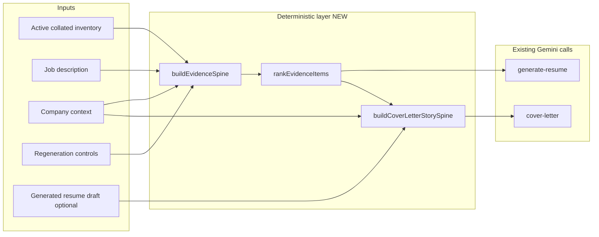

# Matching / Tailoring Engine Upgrade — Implementation Plan

> Archived completed plan. The evidence spine, cover-letter story spine, and evidence-control milestones have shipped.

**Planning milestone:** v0.9.17x (proposed)  
**Prerequisite:** [`AI_CALL_STUDY.md`](../studies/AI_CALL_STUDY.md)  
**Goal:** Boring, explainable evidence selection before Gemini; sharper cover-letter hiring story; no new AI calls.

---

## Build plan checklist (confirmed)

| # | Rule | Status |
|---|------|--------|
| 1 | One focused milestone | **Three sequenced milestones** (spine → cover story → Add Evidence UI) — ship M1 before M2 |
| 2 | Avoid unrelated scope | No export/layout, Inventory CRUD, embeddings, provider switch |
| 3 | No one-off test scripts | Extend `generation-payload`, `cover-letter`, `forced-bullet-regeneration`, `application-review` suites |
| 4 | Tests in existing suites | Yes — new `evidence-spine.test.ts` only if checks overflow one file |
| 5 | Docs under `/docs` | This file + `AI_CALL_STUDY.md`; update `HANDOFF.md` / `KNOWN_ISSUES.md` on ship |
| 6 | Source-grep tests | Avoid new grep tests; behavior tests for ranking |
| 7 | Env vars | None expected |
| 8 | Model IDs | Reuse `model-tiers.ts` — no hardcoding |
| 9 | Risks classified | See [Risks](#risks-and-open-questions) |
| 10 | Commit after complete | Per user request |

---

## Problem statement (audit-aligned)

| Finding | Current code | Target |
|---------|--------------|--------|
| Add Evidence = work bullets only | `listCollatedBulletsWithEditState` in `ResumeEvidenceRegenerationPanel` | All evidence categories, JD-ranked |
| Cover letter evidence = resume draft | `buildResumeEvidenceSpine(draft)` | Full inventory spine; draft for consistency |
| Resume ranking = work-exp centric | `selectGenerationBullets` | Unified spine across categories |
| Matching = token overlap | `countJdTermOverlap`, `story-ranking.ts` | Shared scorer + redundancy + user force/exclude |
| Validation = symptom warnings | `tailoring-quality.ts` | Spine saves selected/omitted/gaps/positioning |
| Keywords standalone proof | Prompt rules only | Advisory unless evidence-tied |

---

## Architecture overview



### Core type (proposed)

`src/lib/evidence/types.ts`:

```ts
export type EvidenceSourceType =
  | "work_bullet"
  | "additional_experience"
  | "education"
  | "skill"
  | "keyword_tied"
  | "imported_text"
  | "company_context"
  | "resume_draft_bullet"
  | "cover_letter_story";

export type EvidenceEligibility = "resume" | "cover_letter" | "both" | "exclude";

export type EvidenceItem = {
  id: string;                    // stable key for UI + controls
  sourceType: EvidenceSourceType;
  sourceId: string;              // bulletKey, collated id, keyword id, etc.
  originalText: string;
  displayLabel: string;          // e.g. "Acme · PM"
  editedText?: string;           // inventory overlay wording
  state: "default" | "forced" | "excluded" | "hidden";
  provenance: "inventory" | "overlay" | "draft" | "context";
  confidence: "high" | "medium" | "low";
  relevanceScore: number;
  matchedJdSignals: string[];    // terms or heuristic requirement labels
  rationale: string;             // one plain-language sentence
  eligibility: EvidenceEligibility;
  hasMetrics: boolean;
  recencySortKey?: number;
};
```

`src/lib/evidence/spine.ts`:

- `collectEvidenceItems(inventory, jd, companyContext?, draft?)` → all items
- `rankEvidenceItems(items, options)` → sorted, deduped
- `buildEvidenceSpineResult(...)` → `{ selected, omitted, gaps, positioningAngle, shortlistForResume, shortlistForCoverLetter, storyInputs }`
- `formatEvidenceSpineForPrompt(result, audience: 'resume' | 'cover_letter')` → compact text/JSON for prompts

**Scoring (deterministic, explainable):**

Reuse and extend:

- `extractJdMatchTerms` / `countJdTermOverlap` (`bullet-payload.ts`)
- `scoreExperienceForGeneration`, `isEarlyCareerExperience` (`tailoring-quality.ts`)
- Commercial signal patterns from `story-ranking.ts` (move to shared `evidence-scoring.ts`)
- Metric detection (`extractMetrics` in tailoring-quality)
- Recency (`getDateRangeEndSortKey`)
- User state: forced +10000, excluded/hidden → omit, acceptedWording +1000
- Redundancy: token overlap ≥0.85 demote duplicate (`areNearDuplicateBullets`)
- Keywords: score only when `keyword` field ties to bullet/additional item; bank-only keywords → advisory list, not spine proof

**Persistence:**

Extend `ResumeDraftInputSnapshot` (or new `evidenceSpineSnapshot` on draft):

```ts
evidenceSpine?: {
  version: 1;
  selectedIds: string[];
  omittedIds: string[];
  positioningAngle: string;
  honestGaps: string[];
  roleSelectionRationale?: string;
  generatedAt: string;
};
```

Cover letter rationale: add optional `storySpine` mirror for explainability.

---

## Milestone 1: Unified Evidence Spine

### Scope

1. Implement collector + ranker across work bullets, additional experience, education bullets/programmes, skills (with technical-only bias for resume), evidence-tied keywords, overlay imports.
2. Wire `buildResumeDraftGenerationInput` to use spine shortlist for experience bullets; pass ranked slices for education/skills/additional (top-N per category).
3. Populate deterministic `selectionAudit` fields on save from spine (merge with Gemini rationale in `prepareGeneratedResumeContent` or save handler).
4. Respect `hiddenBulletKeys`, `excludedBulletKeys`, `forcedBulletKeys`.

### Files likely to change

| File | Change |
|------|--------|
| `src/lib/evidence/types.ts` | **New** — types |
| `src/lib/evidence/collect.ts` | **New** — normalize inventory → items |
| `src/lib/evidence/scoring.ts` | **New** — shared rank features |
| `src/lib/evidence/spine.ts` | **New** — orchestration + formatters |
| `src/lib/resume-draft/bullet-payload.ts` | Delegate to spine or thin wrapper |
| `src/lib/resume-draft/payload.ts` | Build input from spine shortlist |
| `src/lib/resume-draft/prompt.ts` | Mention ranked shortlist; optionally shrink JSON |
| `src/lib/resume-draft/generation-validation.ts` | Attach spine snapshot to prepared result |
| `src/lib/resume-draft/repair-generated-content.ts` | Use spine scores for trim decisions |
| `src/types/resume-draft.ts` | `evidenceSpine` on snapshot / rationale |
| `src/lib/package/fit-summary.ts` | Prefer spine `positioningAngle` / gaps when present |
| `src/lib/application-review/build-application-review-status.ts` | Evidence counts from spine |
| `tests/suites/generation-payload.test.ts` | Cross-category rank, hidden/forced |
| `tests/suites/evidence-spine.test.ts` | **New** if needed for volume |

### Out of scope (M1)

- Cover letter prompt changes (M2)
- Add Evidence UI expansion (M3)

---

## Milestone 2: Cover Letter Story Spine

### Scope

1. `buildCoverLetterStorySpine(spine, companyContext, resumeDraft, jd)` producing:
   - `positioningAngle`
   - `whyThisRole` / `whyThisCompany` (from JD + context, grounded)
   - `proofStories[]` (2–3 top spine items, not necessarily on resume)
   - `supportingSignals[]`
   - `honestGaps[]` / `avoidOverclaim[]`
   - `resumeConsistencyNotes[]` (claims on resume vs spine)
   - `evidenceNotToUse[]` (excluded, redundant, low confidence)
2. Change `generateAndSaveCoverLetterDraft` to build spine from **inventory + JD + context**, not `buildResumeEvidenceSpine(draft)` as primary.
3. Update `buildCoverLetterPrompt` to accept structured story spine + compact ranked evidence list.
4. Update `revise-cover-letter` route to pass full spine.
5. Keep `buildResumeEvidenceSpine` as helper for consistency section only (deprecate as primary input).

### Files likely to change

| File | Change |
|------|--------|
| `src/lib/evidence/story-spine.ts` | **New** |
| `src/lib/generate/cover-letter-generation.ts` | Inventory-based spine input |
| `src/lib/cover-letter/prompt.ts` | Story spine sections |
| `src/lib/cover-letter/resume-evidence.ts` | Consistency formatter; rename clarify |
| `src/lib/cover-letter/story-ranking.ts` | Migrate scoring to `evidence/scoring.ts` or wrap |
| `src/lib/cover-letter/revision-prompt.ts` | Full spine |
| `src/app/api/ai/revise-cover-letter/route.ts` | Load inventory + build spine |
| `src/types/cover-letter-draft.ts` | Optional `storySpine` in rationale |
| `tests/suites/cover-letter.test.ts` | Spine-not-draft assertions |
| `tests/suites/cover-letter.test.ts` | Prompt wiring |

### No new AI call

Story assembly is 100% deterministic. Same single `generate_cover_letter` Gemini call.

---

## Milestone 3: Category-Aware Add Evidence

### Scope

1. Replace flat `availableBullets` list with `buildAddEvidenceList(spine, draft, pendingControls)` sorted by **relevanceScore desc**.
2. Plain-language relevance line per row (`item.rationale` or template from `matchedJdSignals`).
3. Actions:
   - Work bullet: existing add/remove/exclude
   - Additional experience item → force include in resume additional section or cover letter proof
   - Education proof → cover letter / additional
   - Skill proof → cover letter only (not standalone resume claim)
   - Evidence-tied keyword → advisory highlight
   - Cover-letter-only story → `cover_letter_story` pseudo-item (user-authored note in controls — minimal v1: pick high-ranked additional/education for CL-only)
   - Exclude from this application → `excludedBulletKeys` / generalized `excludedEvidenceIds`

4. Extend `ResumeDraftRegenerationControls` → `RegenerationEvidenceControls` with `forcedEvidenceIds` / `excludedEvidenceIds` (keep bullet keys for backward compat).

### Files likely to change

| File | Change |
|------|--------|
| `src/components/resume-drafts/ResumeEvidenceRegenerationPanel.tsx` | Ranked multi-category UI |
| `src/lib/resume-draft/evidence-pending-queue.ts` | New action types |
| `src/lib/resume-draft/forced-bullets.ts` | Generalize forced evidence |
| `src/lib/resume-draft/targeted-role-rewrite.ts` | Non-bullet forced paths where applicable |
| `src/lib/resume-draft/regeneration.ts` | Feasibility for new types |
| `tests/suites/forced-bullet-regeneration.test.ts` | Rank order + categories |
| `tests/suites/application-package-ux.test.ts` | Wiring strings if needed |

### UI principles

- Single scrollable list, category chip (`Work`, `Additional`, `Education`, `Skill`, `Keyword`)
- Show relevance sentence, not numeric score
- No expert tuning controls

---

## Test plan

### Milestone 1

| Check | Suite | Invariant |
|-------|-------|-----------|
| Ranks work + additional + education + skill together | `evidence-spine.test.ts` or `generation-payload.test.ts` | Higher JD-relevant additional beats low-relevant work bullet |
| `hiddenBulletKeys` excluded | `generation-payload.test.ts` | Hidden item not in shortlist |
| `forcedBulletKeys` in shortlist | `generation-payload.test.ts` | Forced present even if low score |
| `excludedBulletKeys` omitted | `generation-payload.test.ts` | Excluded absent |
| Redundant bullets demoted | `evidence-spine.test.ts` | Second near-duplicate lower rank |
| Keywords advisory-only | `generation-payload.test.ts` | Bank keyword without evidence not in proof shortlist |
| Spine snapshot saved | `resume-generation-validation.test.ts` | `inputSnapshot.evidenceSpine` populated |
| Rationale fields from spine | `application-review.test.ts` | positioning/gaps/selected present without Gemini |

### Milestone 2

| Check | Suite | Invariant |
|-------|-------|-----------|
| Cover letter input uses inventory spine | `cover-letter.test.ts` | Strong inventory item not on resume appears in prompt payload |
| Resume draft consistency section | `cover-letter.test.ts` | Draft referenced for consistency, not sole evidence |
| Story spine structure | `cover-letter.test.ts` | Prompt includes why role/company + proof stories |
| Revision route spine | `cover-letter.test.ts` | Revise uses full spine |

### Milestone 3

| Check | Suite | Invariant |
|-------|-------|-----------|
| Add Evidence sort order | `forced-bullet-regeneration.test.ts` | List sorted by relevance, not collation order |
| Additional experience add | `forced-bullet-regeneration.test.ts` | Staging additional item works |
| Exclude from application | `generation-payload.test.ts` | Excluded id survives regen |

### Manual QA (from `TEST_CHECKLIST.md`)

- Generate combined package for JD with niche skill only in Additional Experience — cover letter should cite it.
- Add Evidence panel shows top matches first.
- Full regenerate still respects forced/excluded.

---

## Risks and open questions

| ID | Risk / question | Classification | Mitigation |
|----|-----------------|----------------|------------|
| R1 | Heuristic ranking wrong for edge JDs | Accept Risk | Plain-language rationale + user force/exclude; no auto-regen |
| R2 | Prompt JSON shrink breaks Gemini selection | Investigate Now | M1: keep parallel full inventory until A/B confident; feature flag `USE_EVIDENCE_SPINE_PROMPT` optional |
| R3 | `RegenerationControls` schema migration | Act Now | Additive fields; old drafts default empty |
| R4 | Cover letter rationale blocking if story spine fields empty | Act Now | Deterministic spine must always produce ≥2 role signals + 2 company facts from context/JD when context thin |
| R5 | Education/skill “proof” without bullets | Accept Risk | v1: rank text lines; no new inventory CRUD |
| R6 | Token reduction vs explainability | Park | Log spine size in dev; trim only omitted sections |
| R7 | FIT_SCORE_RUBRIC full JRP | Park | Spine v1 does not implement ai_extracted JRP |
| R8 | Cover-letter-only story user notes | Park | M3 minimal: use ranked non-resume evidence; defer free-text story item |
| R9 | Second critique AI call | Ignore | Study confirms unnecessary |

### Open questions for product

1. **Top-N caps** for education/skills in resume prompt — propose 5 skills, 3 education lines, 5 additional lines (config constants).
2. **Persist spine on cover letter draft** as well as resume — recommended yes for package explainability.
3. **Re-generate cover letter after evidence change** — manual only (current behavior) or prompt user? Recommend manual to avoid hidden cost.

---

## Suggested implementation order

0. **Phase 0 — Prompt & payload hygiene** — **done in v0.9.17A** (see [`PHASE0_PROMPT_HYGIENE.md`](../milestones/PHASE0_PROMPT_HYGIENE.md)).
1. **M1 backend** — types, collect, score, rank, tests (no UI).
2. **M1 wire** — payload + snapshot + fit summary.
3. **M2** — story spine + cover letter prompt + tests.
4. **M3** — Add Evidence UI + generalized controls.
5. **Docs** — `HANDOFF.md`, `KNOWN_ISSUES.md`, `ROADMAP.md` entry v0.9.17A/B/C.

**Version proposal:**

- v0.9.17A — Unified Evidence Spine (M1)
- v0.9.17B — Cover Letter Story Spine (M2)
- v0.9.17C — Category-Aware Add Evidence (M3)

---

## What we are explicitly not doing

- Embeddings / ML ranking
- New Gemini calls (including critique pass)
- Provider / model switch
- Export or layout redesign
- Full Inventory CRUD
- Keywords as standalone proof
- Expert scoring UI
- Automatic cover letter regen on evidence change
